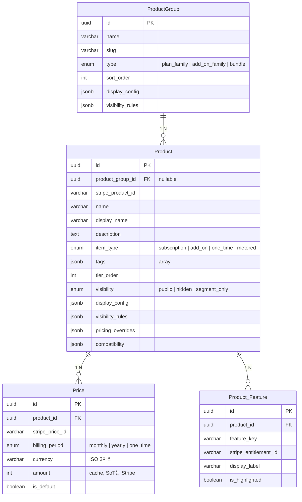
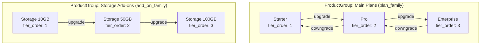
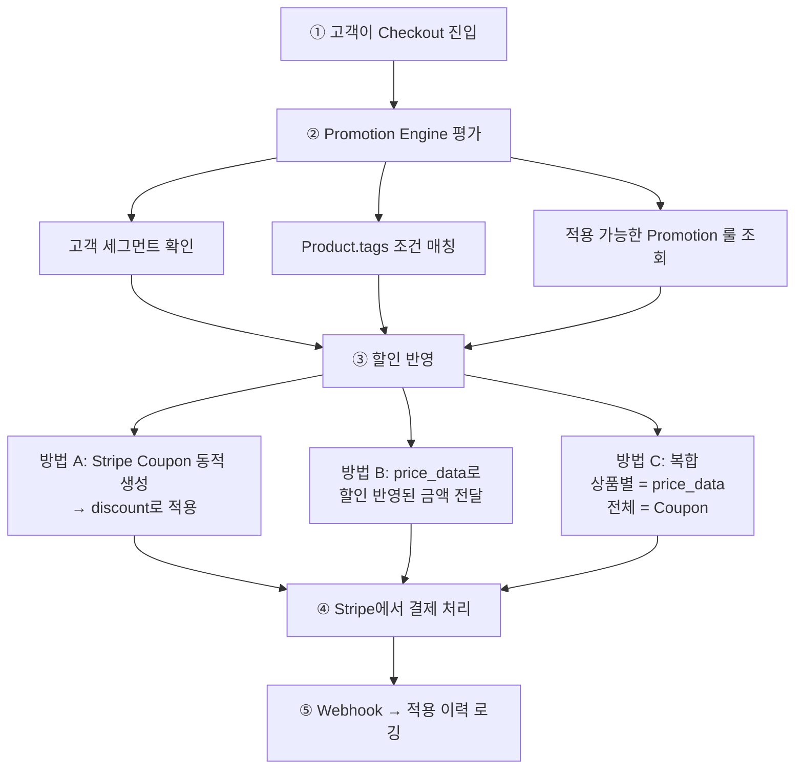
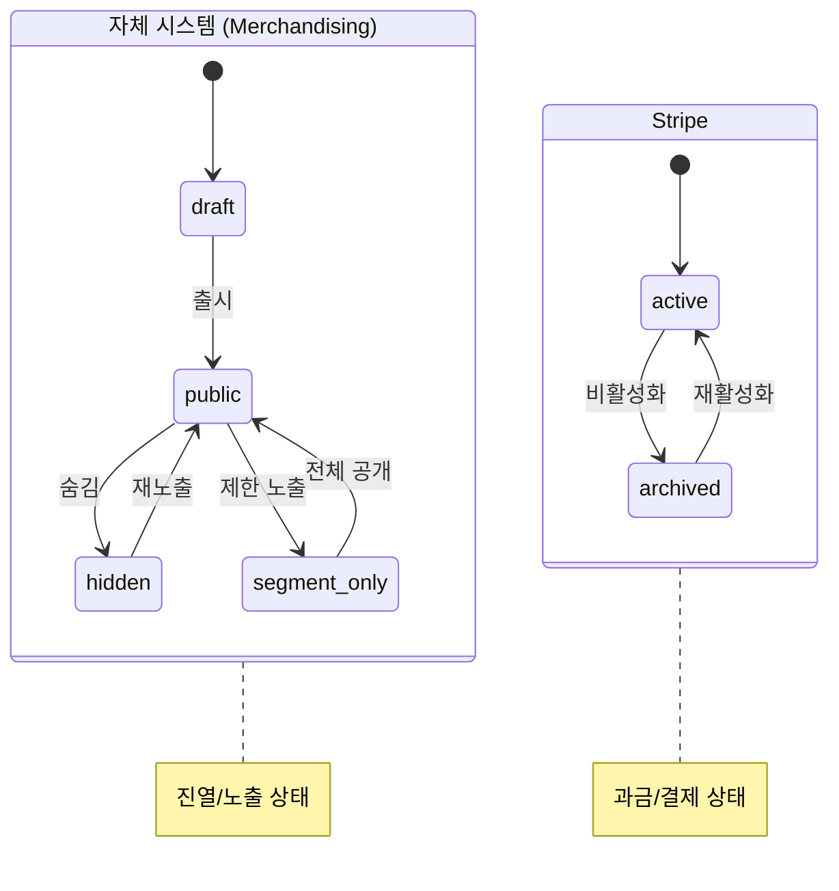
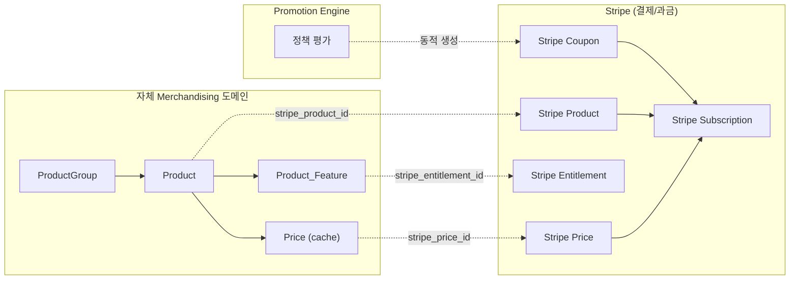

# Product Domain Design Specification

> Stripe 기반 SaaS 이커머스를 위한 Merchandising 도메인 설계

---

## 1. 배경

현재 시스템은 Stripe를 결제/과금 인프라로 사용하며, Product / Price / Subscription / Entitlement 등을 활용하고 있다. 그러나 비즈니스가 확장됨에 따라 Stripe가 제공하지 않는 영역이 필요해졌다.

- 고객 세그먼트별 **차등화된 상품/가격 노출**
- **프로모션/할인 정책**을 유연하게 적용
- **플랜 업/다운그레이드 경로** 정의와 제어
- **상품 분류 체계**와 카테고리 관리
- 단건 상품, Add-on, API/모듈/플러그인 등 **향후 확장** 대응

이 문서는 Stripe와 자체 시스템 간의 경계를 정의하고, Merchandising 도메인의 데이터 모델과 설계 원칙을 제안한다.

---

## 2. 핵심 설계 원칙

> **Stripe에는 결제/과금에 필요한 최소한만 두고,**
> **상품 분류 · 노출 제어 · 프로모션 · 전환 경로는 자체 Merchandising 도메인이 소유한다.**

| 영역 | Source of Truth | 역할 |
|------|----------------|------|
| Stripe | 결제/과금 인프라 | Product, Price, Subscription, Entitlement, Coupon, Invoice |
| 자체 시스템 | Merchandising 도메인 | 분류, 노출, 프로모션, 전환 경로, 의존성 |

---

## 3. Stripe의 Product/Price 설계 의도

### 3.1 Price = 과거 SKU의 후계자

Stripe은 원래 SKU라는 별도 객체를 가지고 있었으나, 현재는 완전히 제거되었다. Plan(recurring), SKU(물리상품), inline line item이 모두 **Price 객체로 통합**되었다.

**Price의 핵심 특성: Immutable Record**

- Price의 금액(amount)은 변경할 수 없다
- 금액을 바꾸려면 새로운 Price를 생성해야 한다
- 이는 기존 Price를 과거 거래의 불변 기록으로 보존하기 위함이다

### 3.2 우리 설계에서의 의미

Price가 SKU 역할이라면, 프로모션을 위해 세그먼트별 Price를 별도로 만드는 것은 **상품 카탈로그의 오염**이다. Stripe가 의도한 관심사 분리는 다음과 같다.

| Stripe 객체 | 의도된 용도 |
|------------|-----------|
| Product | 이 상품이 본질적으로 무엇인가 (플랜 티어 단위) |
| Price | 이 상품의 정가(list price) — 통화, 과금주기별 변형 |
| Coupon | 프로모션 할인 적용 (Price를 건드리지 않음) |
| Entitlement | 구독 상품에 연결된 기능 접근 권한 |

---

## 4. Merchandising 도메인이 필요한 이유

Stripe는 결제 인프라이지 상품 관리 플랫폼이 아니다. 다음은 Stripe가 의도적으로 제공하지 않는 영역이다.

| 필요 기능 | Stripe 제공 여부 |
|----------|----------------|
| 상품 분류/계층 구조 | 없음 — Product는 flat list만 존재 |
| 세그먼트별 노출 제어 | 없음 — Customer metadata로 간접적으로만 가능 |
| 조건부 프로모션 정책 | 없음 — Coupon/Promotion Code는 단순 할인만 가능 |
| 플랜 전환 경로 정의 | 없음 — Subscription 변경은 API로 가능하나 경로 정의는 없음 |
| 상품 간 의존/호환성 | 없음 — Add-on이 base 플랜을 요구하는 관계 표현 불가 |

---

## 5. 데이터 모델

### 5.1 전체 구조



> **테이블 4개**로 구성된다. 복잡도가 올라가면 JSON 컬럼을 별도 테이블로 분리하는 경로가 열려 있다.

### 5.2 설계 포인트: ProductGroup → Product는 1:N

M:N이 아닌 1:N을 선택한 이유:

- **M:N은 tier_order 충돌을 유발한다.** Product가 두 그룹에서 다른 순서를 가지면 전환 로직이 모호해진다.
- **"이 상품의 소속"이라는 단순한 질문**에 항상 join + 추가 조건이 필요하다.
- **횡단적 분류**(프로모션 대상, 시즌 묶음)는 Product의 `tags`로 처리한다.
- 상품 수가 수백 개 이상으로 늘어나면 그때 M:N으로 전환을 검토한다.

---

## 6. ProductGroup 상세

상품 간의 **구조적 관계**를 정의하는 그룹이다. `type` 필드로 용도를 구분한다.

### 6.1 type별 용도

| type | 용도 | 예시 |
|------|-----|------|
| `plan_family` | 업/다운그레이드 경로를 정의하는 티어 라인 | Starter → Pro → Enterprise |
| `add_on_family` | 같은 축의 Add-on 묶음 | Storage 10GB / 50GB / 100GB |
| `bundle` | 플랜 + 모듈 조합 패키지 | Pro + Analytics + API Premium |

### 6.2 구조 예시



---

## 7. Product 상세

### 7.1 item_type별 Stripe 연동 방식

`item_type`은 Stripe 연동 방식, 결제 흐름, Entitlement 부여 방식을 결정하는 **핵심 분기 축**이다.

| item_type | Stripe 연동 | 과금 방식 |
|-----------|------------|----------|
| `subscription` | Stripe Subscription | recurring (monthly/yearly) |
| `add_on` | Subscription Item 추가 | base subscription에 종속 |
| `one_time` | Checkout Session 일회 결제 | 단건 결제 |
| `metered` | Usage Record 보고 후 과금 | API 호출 건수 등 사용량 기반 |

### 7.2 tags 활용

태그는 **횡단적 분류**에 사용한다. 별도 테이블이 아닌 JSON array로 관리한다.

```json
["promotional", "new_2026", "enterprise_only", "api_product"]
```

- 프로모션 룰의 조건으로 활용: `tags contains "promotional"`
- 필터링/검색에 활용: PostgreSQL `jsonb @>` 연산자
- 상품 수가 적은 SaaS에서는 정규화된 Tag 테이블보다 실용적

---

## 8. JSON 컬럼 상세 설계

JSON 컬럼은 **목적별로 분리**하여 관심사를 명확히 한다. 하나의 metadata 블롭에 통합하지 않는다.

### 8.1 설계 원칙

- 쿼리 조건으로 자주 쓰이는 필드는 → **정규 컬럼**
- 읽기 전용이거나 통째로 가져다 쓰는 설정은 → **JSON 컬럼**
- 용도가 다른 데이터는 컬럼부터 분리 → **팀별 소유권이 다른 데이터를 한 블롭에 섞지 않음**

### 8.2 display_config

순수 UI/프레젠테이션 관심사. 변경해도 비즈니스 로직에 영향 없음.

```json
{
  "hero_image": "https://...",
  "badge": "POPULAR",
  "cta_text": {
    "default": "시작하기",
    "enterprise": "영업팀 문의"
  },
  "feature_highlights": ["무제한 API 호출", "전용 서포트"]
}
```

### 8.3 visibility_rules

누구에게 보여줄 것인가. 접근 제어 성격이므로 display_config와 분리.

```json
{
  "segments": ["new_customer", "enterprise"],
  "geo": ["KR", "US"],
  "exclude_segments": ["churned"]
}
```

### 8.4 pricing_overrides

세그먼트별 가격 표시 제어. 결제 흐름에 직접 영향을 주므로 UI 설정과 분리.

```json
{
  "enterprise": {
    "stripe_price_id": "price_enterprise_special",
    "display_label": "기업 특별가"
  }
}
```

### 8.5 compatibility

Add-on/모듈 확장 시 핵심. 상품 간 의존/충돌/포함 관계.

```json
{
  "requires_any": ["prod_pro", "prod_enterprise"],
  "min_tier": 2,
  "conflicts_with": ["prod_legacy_analytics"],
  "included_in": ["prod_enterprise"]
}
```

> `included_in`은 Enterprise 플랜에 이미 포함된 모듈을 별도 구매하지 않도록 하는 데 사용한다. Checkout 시 "이미 현재 플랜에 포함되어 있습니다"를 표시하려면 이 정보가 Product 레벨에 있어야 한다.

---

## 9. 플랜 전환 경로

플랜 전환은 `ProductGroup(type=plan_family)` 내의 `tier_order`로 판단한다.

```
tier_order 낮은 → 높은 = 업그레이드
tier_order 높은 → 낮은 = 다운그레이드
```

전환 시 Stripe Subscription API를 호출하며, proration 방식은 서비스 레이어에서 결정한다. 별도의 PlanTransition 테이블은 초기에는 불필요하며, 전환 제약 조건이 복잡해지면 그때 추가한다.

---

## 10. 프로모션 연동 흐름

프로모션 정책은 자체 Promotion Engine이 평가하고, Stripe Coupon을 통해 적용한다.



> **핵심: Price는 카탈로그(정가), Coupon은 프로모션(할인)**
>
> Price에 할인가를 별도로 만들지 않는다. Stripe의 설계 의도대로 Price = SKU(불변), Coupon = 할인(결제 시점 적용)으로 분리한다.

---

## 11. 라이프사이클 분리

> **주의: Product(자체)와 Stripe Product의 상태는 독립적이다.**

- Product를 `hidden` 처리해도 Stripe Product는 `active` → 기존 구독자 과금 유지
- Stripe에서 Price를 `archive`해도 Product는 "Coming Soon"으로 노출 가능
- 두 시스템의 상태를 강제 동기화하지 않는다



---

## 12. Stripe 연동 전체 구조



---

## 13. 확장 경로

현재 설계는 최소 테이블로 시작하되, 복잡도가 올라가면 점진적으로 분리하는 경로를 열어둔다.

| 변화 시점 | 현재 처리 방식 | 전환 방식 |
|----------|-------------|----------|
| 상품 수백 개 이상 | ProductGroup → Product 1:N | M:N 중간 테이블 추가 |
| visibility 조건 복잡화 | `visibility_rules` JSON 컬럼 | 별도 SegmentView 테이블 |
| 전환 제약 복잡화 | `tier_order` + 서비스 로직 | 별도 PlanTransition 테이블 |
| 상품 의존성 복잡화 | `compatibility` JSON 컬럼 | 별도 Dependency 테이블 |
| Promotion 룰 복잡화 | `tags` 기반 조건 평가 | Promotion / Condition / Action 테이블 |

---

## 14. 요약

1. **Stripe에는 결제/과금에 필요한 최소한만 둔다.**
2. **Merchandising 도메인은 자체 시스템이 소유한다** — ProductGroup → Product → Price, 테이블 4개로 구성.
3. **JSON 컬럼은 목적별로 분리한다** — `display_config` / `visibility_rules` / `pricing_overrides` / `compatibility`.
4. **ProductGroup → Product는 1:N으로 시작한다** — 횡단적 분류는 `tags`로 처리.
5. **item_type으로 구독/단건/Add-on/종량과금을 구분한다** — 향후 확장 대비.
6. **프로모션은 Stripe Coupon으로 적용한다** — Price를 오염시키지 않음.
7. **복잡도가 올라가면 JSON → 테이블로 점진적 분리한다.**
