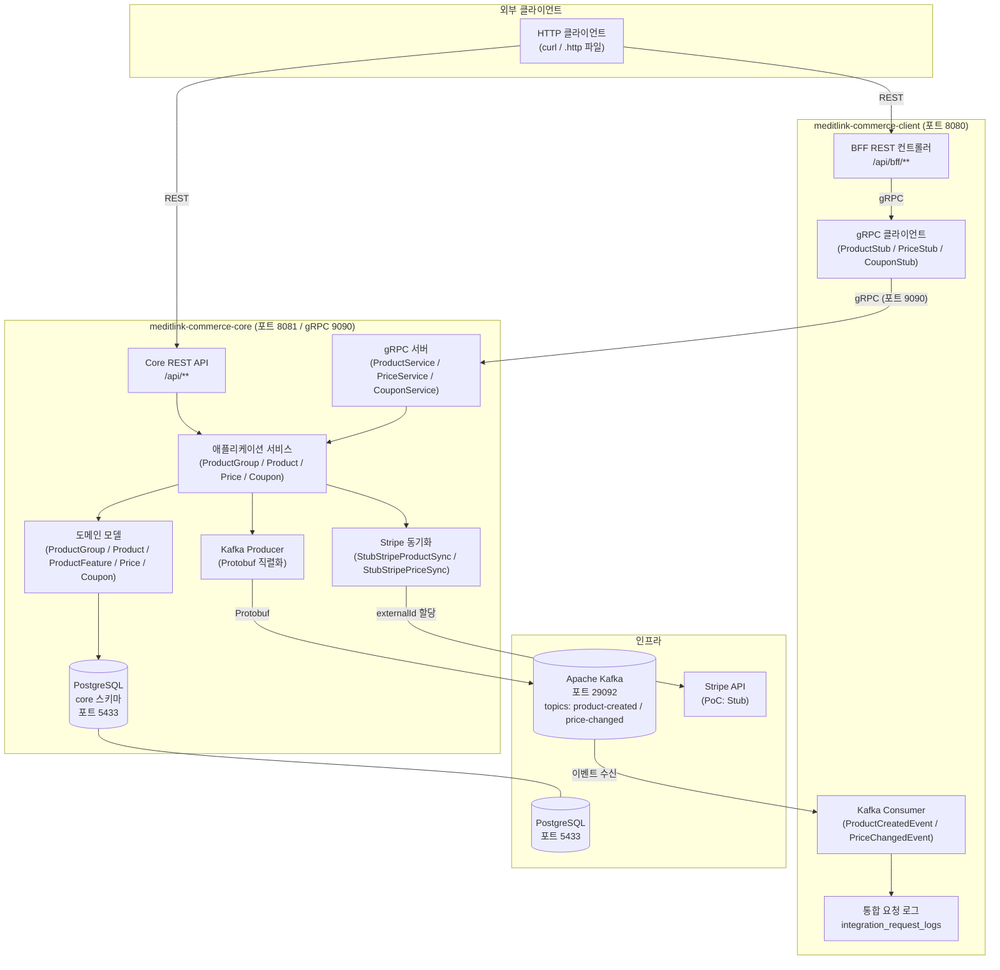
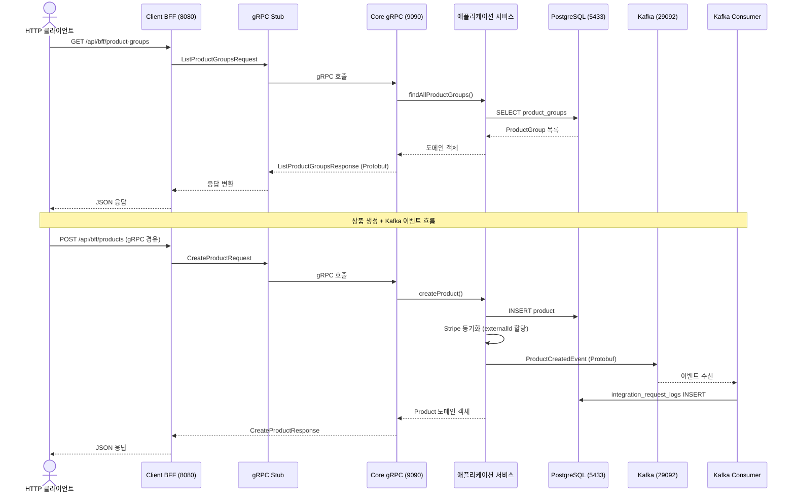
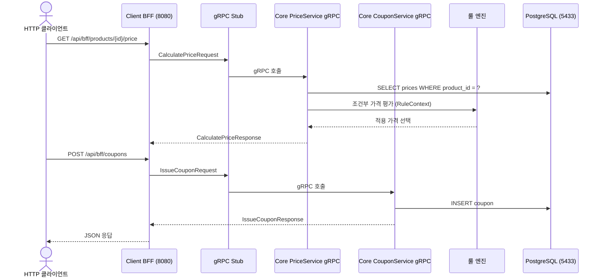
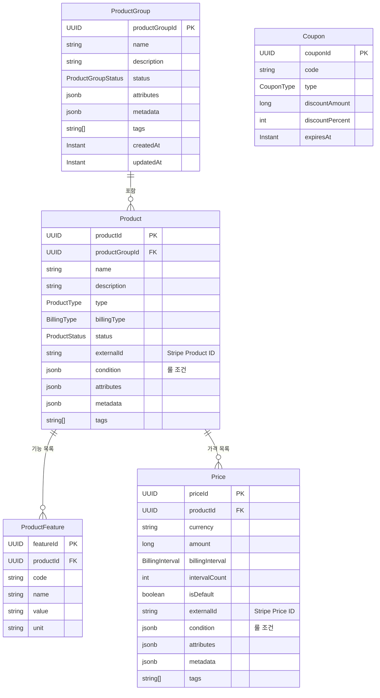

# E-Commerce PoC 데모 가이드

이 문서는 DDD 기반 모듈러 모놀리스 E-Commerce PoC의 전체 시스템 구조와 데모 시나리오를 정리한다.

---

## 1. 전체 시스템 아키텍처



---

## 2. 요청 흐름 시퀀스 다이어그램

### 2-1. BFF를 통한 상품 조회 흐름



### 2-2. 가격 계산 + 쿠폰 적용 흐름



---

## 3. 도메인 모델 다이어그램



---

## 4. API 엔드포인트 정리

### Core 서비스 REST API (포트 8081)

| 메서드 | 경로 | 설명 |
|--------|------|------|
| POST | `/api/product-groups` | ProductGroup 생성 |
| GET | `/api/product-groups` | ProductGroup 전체 목록 조회 |
| GET | `/api/product-groups/{id}` | ProductGroup 단건 조회 |
| PUT | `/api/product-groups/{id}` | ProductGroup 수정 |
| DELETE | `/api/product-groups/{id}` | ProductGroup 삭제 |
| POST | `/api/product-groups/{id}/activate` | ProductGroup 활성화 |
| POST | `/api/product-groups/{id}/archive` | ProductGroup 아카이브 |
| POST | `/api/product-groups/{productGroupId}/products` | Product 생성 |
| GET | `/api/products/{id}` | Product 단건 조회 |
| PUT | `/api/products/{id}` | Product 수정 |
| DELETE | `/api/products/{id}` | Product 삭제 |
| POST | `/api/products/{productId}/features` | Feature 추가 |
| DELETE | `/api/products/{productId}/features/{featureCode}` | Feature 삭제 |
| GET | `/api/products/{productId}/features` | Feature 목록 조회 |
| POST | `/api/products/{productId}/prices` | Price 생성 |
| DELETE | `/api/prices/{id}` | Price 삭제 |

### Core 서비스 gRPC API (포트 9090)

| 서비스 | 메서드 | 설명 |
|--------|--------|------|
| ProductService | CreateProduct | Product 생성 |
| ProductService | GetProduct | Product 단건 조회 |
| ProductService | ListProductGroups | ProductGroup 목록 조회 |
| ProductService | ListProductPlans | Product 플랜 목록 조회 |
| PriceService | CalculatePrice | 가격 계산 (룰 엔진 적용) |
| CouponService | IssueCoupon | 쿠폰 발급 |

### Client BFF REST API (포트 8080)

| 메서드 | 경로 | 설명 | 내부 gRPC 호출 |
|--------|------|------|----------------|
| GET | `/api/bff/product-groups` | ProductGroup 목록 조회 | ListProductGroups |
| GET | `/api/bff/products/{id}` | Product 상세 조회 | GetProduct |
| GET | `/api/bff/products/{id}/price` | 가격 계산 결과 조회 | CalculatePrice |
| GET | `/api/bff/products/{id}/plans` | Product 플랜 목록 | ListProductPlans |
| POST | `/api/bff/coupons` | 쿠폰 발급 | IssueCoupon |

### Kafka 토픽

| 토픽명 | 이벤트 타입 | 직렬화 | 발행 주체 |
|--------|------------|--------|----------|
| `product-created` | ProductCreatedEvent | Protobuf | Core |
| `product-updated` | ProductUpdatedEvent | Protobuf | Core |
| `price-changed` | PriceChangedEvent | Protobuf | Core |

---

## 5. 데모 시나리오 (단계별)

### 사전 준비: 환경 시작

```bash
# 전체 Docker Compose 스택 시작
docker compose up -d

# 서비스 헬스 확인
curl http://localhost:8081/actuator/health   # Core
curl http://localhost:8080/actuator/health   # Client
```

---

### Step 1: ProductGroup 생성 + 활성화

**1-1. ProductGroup 생성**

```bash
curl -X POST http://localhost:8081/api/product-groups \
  -H "Content-Type: application/json" \
  -d '{
    "name": "메디링크 SaaS 플랜",
    "description": "의료기관 대상 구독형 서비스 그룹",
    "attributes": {"market": "B2B", "vertical": "healthcare"},
    "tags": ["saas", "medical"]
  }'
```

예상 응답:
```json
{
  "productGroupId": "{{GROUP_ID}}",
  "name": "메디링크 SaaS 플랜",
  "status": "DRAFT",
  ...
}
```

**1-2. ProductGroup 활성화**

```bash
curl -X POST http://localhost:8081/api/product-groups/{{GROUP_ID}}/activate
```

예상 응답: `status: "ACTIVE"`

---

### Step 2: Product 생성 (Stripe 동기화 → externalId)

```bash
curl -X POST http://localhost:8081/api/product-groups/{{GROUP_ID}}/products \
  -H "Content-Type: application/json" \
  -d '{
    "name": "스탠다드 플랜",
    "description": "기본 기능 포함 월정액 플랜",
    "type": "SUBSCRIPTION",
    "billingType": "RECURRING",
    "attributes": {"tier": "standard"},
    "tags": ["monthly", "standard"]
  }'
```

예상 응답:
```json
{
  "productId": "{{PRODUCT_ID}}",
  "name": "스탠다드 플랜",
  "externalId": "prod_stub_...",  // Stripe Stub이 할당한 externalId
  "status": "ACTIVE",
  ...
}
```

> PoC에서는 `StubStripeProductSync`가 `prod_stub_{UUID}` 형태의 externalId를 즉시 반환한다.

---

### Step 3: Feature 추가 (storage, design-editor)

**3-1. 스토리지 기능 추가**

```bash
curl -X POST http://localhost:8081/api/products/{{PRODUCT_ID}}/features \
  -H "Content-Type: application/json" \
  -d '{
    "code": "storage",
    "name": "클라우드 스토리지",
    "value": "100",
    "unit": "GB"
  }'
```

**3-2. 디자인 에디터 기능 추가**

```bash
curl -X POST http://localhost:8081/api/products/{{PRODUCT_ID}}/features \
  -H "Content-Type: application/json" \
  -d '{
    "code": "design-editor",
    "name": "디자인 에디터",
    "value": "true",
    "unit": "boolean"
  }'
```

**3-3. 기능 목록 확인**

```bash
curl http://localhost:8081/api/products/{{PRODUCT_ID}}/features
```

---

### Step 4: Price 생성 (기본/연간/조건부)

**4-1. 기본 월정액 가격**

```bash
curl -X POST http://localhost:8081/api/products/{{PRODUCT_ID}}/prices \
  -H "Content-Type: application/json" \
  -d '{
    "currency": "KRW",
    "amount": 99000,
    "billingInterval": "MONTH",
    "intervalCount": 1,
    "isDefault": true,
    "tags": ["monthly", "default"]
  }'
```

**4-2. 연간 구독 가격 (17% 할인)**

```bash
curl -X POST http://localhost:8081/api/products/{{PRODUCT_ID}}/prices \
  -H "Content-Type: application/json" \
  -d '{
    "currency": "KRW",
    "amount": 990000,
    "billingInterval": "YEAR",
    "intervalCount": 1,
    "isDefault": false,
    "tags": ["annual", "discount"]
  }'
```

**4-3. 조건부 가격 (엔터프라이즈 고객 대상)**

```bash
curl -X POST http://localhost:8081/api/products/{{PRODUCT_ID}}/prices \
  -H "Content-Type: application/json" \
  -d '{
    "currency": "KRW",
    "amount": 79000,
    "billingInterval": "MONTH",
    "intervalCount": 1,
    "isDefault": false,
    "condition": {
      "operator": "AND",
      "rules": [
        {"attribute": "customer.type", "operator": "EQ", "value": "enterprise"}
      ]
    },
    "tags": ["enterprise", "conditional"]
  }'
```

---

### Step 5: BFF를 통한 조회 (gRPC 경유)

**5-1. ProductGroup 목록 조회 (BFF → gRPC → Core)**

```bash
curl http://localhost:8080/api/bff/product-groups
```

**5-2. Product 상세 조회 (BFF → gRPC → Core)**

```bash
curl http://localhost:8080/api/bff/products/{{PRODUCT_ID}}
```

> Client(8080)이 Core gRPC(9090)를 호출하여 Protobuf로 통신한다.

---

### Step 6: 가격 계산 + 쿠폰 적용

**6-1. 가격 계산 요청 (룰 엔진 적용)**

```bash
curl "http://localhost:8080/api/bff/products/{{PRODUCT_ID}}/price"
```

> 룰 엔진(`RuleEngine`)이 `RuleContext`를 평가하여 적합한 `Price`를 선택한다.

**6-2. 쿠폰 발급**

```bash
curl -X POST http://localhost:8080/api/bff/coupons \
  -H "Content-Type: application/json" \
  -d '{
    "productId": "{{PRODUCT_ID}}",
    "discountType": "PERCENT",
    "discountPercent": 10,
    "expiresAt": "2026-12-31T23:59:59Z"
  }'
```

예상 응답:
```json
{
  "couponId": "{{COUPON_ID}}",
  "code": "COUPON-{{UUID}}",
  "discountPercent": 10,
  "expiresAt": "2026-12-31T23:59:59Z"
}
```

**6-3. 플랜 목록 조회**

```bash
curl http://localhost:8080/api/bff/products/{{PRODUCT_ID}}/plans
```

---

### Step 7: Kafka 이벤트 수신 확인

Product 생성 또는 Price 변경 시 Core가 Kafka에 Protobuf 이벤트를 발행하고, Client Consumer가 수신하여 로그에 기록한다.

**7-1. Kafka 토픽 메시지 직접 확인**

```bash
# Docker 컨테이너 내부에서 확인
docker exec -it kafka kafka-console-consumer.sh \
  --bootstrap-server localhost:9092 \
  --topic product-created \
  --from-beginning \
  --property print.key=true
```

**7-2. Client Consumer 로그 확인**

```bash
docker logs meditlink-commerce-client --tail 50 | grep "이벤트"
```

> Client Consumer가 수신한 이벤트는 `integration_request_logs` 테이블에도 기록된다.

**7-3. DB 로그 확인**

```sql
-- integration 스키마 (Client 서비스 DB)
SELECT request_type, reference_id, status, created_at
FROM integration_request_logs
ORDER BY created_at DESC
LIMIT 10;
```

---

## 6. 환경 구성 요약

| 서비스 | 포트 | 역할 |
|--------|------|------|
| meditlink-commerce-core | 8081 (HTTP), 9090 (gRPC) | 핵심 도메인 서비스 |
| meditlink-commerce-client | 8080 (HTTP) | BFF / 통합 계층 |
| PostgreSQL | 5433 | 영속성 저장소 |
| Kafka | 29092 (외부), 9092 (내부) | 비동기 이벤트 브로커 |

### DB 스키마 분리

| 스키마 | 소유 서비스 | 주요 테이블 |
|--------|------------|------------|
| `core` | meditlink-commerce-core | product_groups, products, product_features, prices, coupons |
| `integration` | meditlink-commerce-client | integration_request_logs |

---

## 7. 주요 설계 원칙

| 원칙 | 적용 내용 |
|------|----------|
| **DDD** | ProductGroup, Product, Price, Coupon을 독립 Aggregate로 설계 |
| **모듈러 모놀리스** | Core / Client 모듈 분리, 내부 API(`ProductModuleApi`)로 경계 강제 |
| **헥사고날 아키텍처** | 포트(Port) & 어댑터(Adapter) 패턴, 인프라 의존성 역전 |
| **이벤트 기반** | Kafka + Protobuf로 모듈 간 비동기 통신 |
| **조건부 가격** | 룰 엔진(`RuleEngine`)으로 동적 가격 선택 |
| **Stripe 동기화** | `StripeProductSync` / `StripePriceSync` 포트, PoC는 Stub 구현 |

---

*최종 업데이트: 2026-03-11*
